# BarbApp Database Schema

This document outlines the database schema for the BarbApp application, generated from the PostgreSQL database.

## Table of Contents
- [Tables](#tables)
  - [`__EFMigrationsHistory`](#__efmigrationshistory)
  - [`addresses`](#addresses)
  - [`admin_barbearia_users`](#admin_barbearia_users)
  - [`admin_central_users`](#admin_central_users)
  - [`appointments`](#appointments)
  - [`barbers`](#barbers)
  - [`barbershop_services`](#barbershop_services)
  - [`barbershops`](#barbershops)
  - [`customers`](#customers)
  - [`landing_page_configs`](#landing_page_configs)
  - [`landing_page_services`](#landing_page_services)
- [Relationships](#relationships)
- [Indexes](#indexes)

## Tables

### `__EFMigrationsHistory`
This table is used by Entity Framework Core to track database migrations.

| Column         | Type                  | Constraints |
|----------------|-----------------------|-------------|
| MigrationId    | character varying(150)| **NOT NULL, PRIMARY KEY** |
| ProductVersion | character varying(32) | **NOT NULL** |

### `addresses`
Stores address information.

| Column         | Type                       | Constraints |
|----------------|----------------------------|-------------|
| address_id     | uuid                       | **NOT NULL, PRIMARY KEY** |
| zip_code       | character varying(10)      | **NOT NULL** |
| street         | character varying(255)     | **NOT NULL** |
| number         | character varying(20)      | **NOT NULL** |
| complement     | character varying(255)     |             |
| neighborhood   | character varying(255)     | **NOT NULL** |
| city           | character varying(255)     | **NOT NULL** |
| state          | character varying(2)       | **NOT NULL** |
| created_at     | timestamp with time zone   | **NOT NULL** |
| updated_at     | timestamp with time zone   | **NOT NULL** |

### `admin_barbearia_users`
Stores administrator users for a specific barbershop.

| Column                    | Type                       | Constraints |
|---------------------------|----------------------------|-------------|
| admin_barbearia_user_id   | uuid                       | **NOT NULL, PRIMARY KEY** |
| barbearia_id              | uuid                       | **NOT NULL** |
| email                     | character varying(255)     | **NOT NULL** |
| password_hash             | text                       | **NOT NULL** |
| name                      | character varying(255)     | **NOT NULL** |
| is_active                 | boolean                    | **NOT NULL** |
| created_at                | timestamp with time zone   | **NOT NULL** |
| updated_at                | timestamp with time zone   | **NOT NULL** |

### `admin_central_users`
Stores central administrator users of the system.

| Column                  | Type                       | Constraints |
|-------------------------|----------------------------|-------------|
| admin_central_user_id   | uuid                       | **NOT NULL, PRIMARY KEY** |
| email                   | character varying(255)     | **NOT NULL** |
| password_hash           | character varying(255)     | **NOT NULL** |
| name                    | character varying(255)     | **NOT NULL** |
| is_active               | boolean                    | **NOT NULL** |
| created_at              | timestamp with time zone   | **NOT NULL** |
| updated_at              | timestamp with time zone   | **NOT NULL** |

### `appointments`
Stores appointment information.

| Column         | Type                       | Constraints |
|----------------|----------------------------|-------------|
| appointment_id | uuid                       | **NOT NULL, PRIMARY KEY** |
| barbearia_id   | uuid                       | **NOT NULL** |
| barber_id      | uuid                       | **NOT NULL** |
| customer_id    | uuid                       | **NOT NULL** |
| service_id     | uuid                       | **NOT NULL** |
| start_time     | timestamp with time zone   | **NOT NULL** |
| end_time       | timestamp with time zone   | **NOT NULL** |
| status         | character varying(20)      | **NOT NULL** |
| cancelled_at   | timestamp with time zone   |             |
| completed_at   | timestamp with time zone   |             |
| confirmed_at   | timestamp with time zone   |             |
| created_at     | timestamp with time zone   | **NOT NULL**, DEFAULT '-infinity'::timestamp with time zone |
| updated_at     | timestamp with time zone   | **NOT NULL**, DEFAULT '-infinity'::timestamp with time zone |

### `barbers`
Stores barber information.

| Column         | Type                       | Constraints |
|----------------|----------------------------|-------------|
| barber_id      | uuid                       | **NOT NULL, PRIMARY KEY** |
| barbearia_id   | uuid                       | **NOT NULL** |
| phone          | character varying(11)      | **NOT NULL** |
| name           | character varying(100)     | **NOT NULL** |
| is_active      | boolean                    | **NOT NULL** |
| created_at     | timestamp with time zone   | **NOT NULL** |
| updated_at     | timestamp with time zone   | **NOT NULL** |
| email          | character varying(255)     | **NOT NULL**, DEFAULT '' |
| password_hash  | text                       | **NOT NULL**, DEFAULT '' |
| service_ids    | uuid[]                     | **NOT NULL** |

### `barbershop_services`
Stores the services offered by a barbershop.

| Column           | Type                       | Constraints |
|------------------|----------------------------|-------------|
| service_id       | uuid                       | **NOT NULL, PRIMARY KEY** |
| barbearia_id     | uuid                       | **NOT NULL** |
| name             | character varying(100)     | **NOT NULL** |
| description      | character varying(500)     |             |
| duration_minutes | integer                    | **NOT NULL** |
| price            | numeric(10,2)              | **NOT NULL** |
| is_active        | boolean                    | **NOT NULL** |
| created_at       | timestamp with time zone   | **NOT NULL** |
| updated_at       | timestamp with time zone   | **NOT NULL** |

### `barbershops`
Stores barbershop information.

| Column         | Type                       | Constraints |
|----------------|----------------------------|-------------|
| barbershop_id  | uuid                       | **NOT NULL, PRIMARY KEY** |
| code           | character varying(8)       | **NOT NULL** |
| name           | character varying(255)     | **NOT NULL** |
| is_active      | boolean                    | **NOT NULL** |
| created_at     | timestamp with time zone   | **NOT NULL** |
| updated_at     | timestamp with time zone   | **NOT NULL** |
| address_id     | uuid                       | **NOT NULL**, DEFAULT '00000000-0000-0000-0000-000000000000' |
| created_by     | character varying(255)     | **NOT NULL**, DEFAULT '' |
| document       | character varying(14)      | **NOT NULL**, DEFAULT '' |
| document_type  | integer                    | **NOT NULL**, DEFAULT 0 |
| email          | character varying(255)     | **NOT NULL**, DEFAULT '' |
| owner_name     | character varying(255)     | **NOT NULL**, DEFAULT '' |
| phone          | character varying(15)      | **NOT NULL**, DEFAULT '' |
| updated_by     | character varying(255)     | **NOT NULL**, DEFAULT '' |

### `customers`
Stores customer information.

| Column         | Type                       | Constraints |
|----------------|----------------------------|-------------|
| customer_id    | uuid                       | **NOT NULL, PRIMARY KEY** |
| barbearia_id   | uuid                       | **NOT NULL** |
| telefone       | character varying(11)      | **NOT NULL** |
| name           | character varying(255)     | **NOT NULL** |
| is_active      | boolean                    | **NOT NULL** |
| created_at     | timestamp with time zone   | **NOT NULL** |
| updated_at     | timestamp with time zone   | **NOT NULL** |

### `clientes`
Stores client information for the new appointment system.

| Column         | Type                       | Constraints |
|----------------|----------------------------|-------------|
| cliente_id     | uuid                       | **NOT NULL, PRIMARY KEY** |
| barbearia_id   | uuid                       | **NOT NULL** |
| nome           | character varying(200)     | **NOT NULL** |
| telefone       | character varying(11)      | **NOT NULL** |
| data_criacao   | timestamp with time zone   | **NOT NULL** |
| data_atualizacao | timestamp with time zone | **NOT NULL** |

### `agendamentos`
Stores appointment information for the new appointment system.

| Column         | Type                       | Constraints |
|----------------|----------------------------|-------------|
| agendamento_id | uuid                       | **NOT NULL, PRIMARY KEY** |
| barbearia_id   | uuid                       | **NOT NULL** |
| cliente_id     | uuid                       | **NOT NULL** |
| barbeiro_id    | uuid                       | **NOT NULL** |
| servico_id     | uuid                       | **NOT NULL** |
| data_hora      | timestamp with time zone   | **NOT NULL** |
| duracao_total  | integer                    | **NOT NULL** |
| status         | integer                    | **NOT NULL** |
| data_cancelamento | timestamp with time zone |             |
| data_criacao   | timestamp with time zone   | **NOT NULL** |
| data_atualizacao | timestamp with time zone | **NOT NULL** |

### `landing_page_configs`

| Column                  | Type                       | Constraints |
|-------------------------|----------------------------|-------------|
| landing_page_config_id  | uuid                       | **NOT NULL, PRIMARY KEY** |
| barbershop_id           | uuid                       | **NOT NULL** |
| template_id             | integer                    | **NOT NULL** |
| logo_url                | character varying(500)     |             |
| about_text              | character varying(2000)    |             |
| opening_hours           | character varying(500)     |             |
| instagram_url           | character varying(255)     |             |
| facebook_url            | character varying(255)     |             |
| whatsapp_number         | character varying(20)      | **NOT NULL** |
| is_published            | boolean                    | **NOT NULL**, DEFAULT true |
| created_at              | timestamp with time zone   | **NOT NULL** |
| updated_at              | timestamp with time zone   | **NOT NULL** |

### `landing_page_services`

| Column                    | Type                       | Constraints |
|---------------------------|----------------------------|-------------|
| landing_page_service_id   | uuid                       | **NOT NULL, PRIMARY KEY** |
| landing_page_config_id    | uuid                       | **NOT NULL** |
| service_id                | uuid                       | **NOT NULL** |
| display_order             | integer                    | **NOT NULL**, DEFAULT 0 |
| is_visible                | boolean                    | **NOT NULL**, DEFAULT true |
| created_at                | timestamp with time zone   | **NOT NULL** |

---

## Relationships

This section describes the foreign key relationships between the tables.

| From Table                | Foreign Key    | To Table          | Primary Key     |
|---------------------------|----------------|-------------------|-----------------|
| `admin_barbearia_users`   | `barbearia_id` | `barbershops`     | `barbershop_id` |
| `appointments`            | `barber_id`    | `barbers`         | `barber_id`     |
| `appointments`            | `barbearia_id` | `barbershops`     | `barbershop_id` |
| `appointments`            | `service_id`   | `barbershop_services` | `service_id` |
| `barbers`                 | `barbearia_id` | `barbershops`     | `barbershop_id` |
| `barbershop_services`     | `barbearia_id` | `barbershops`     | `barbershop_id` |
| `barbershops`             | `address_id`   | `addresses`       | `address_id`    |
| `customers`               | `barbearia_id` | `barbershops`     | `barbershop_id` |
| `clientes`                | `barbearia_id` | `barbershops`     | `barbershop_id` |
| `agendamentos`            | `barbearia_id` | `barbershops`     | `barbershop_id` |
| `agendamentos`            | `cliente_id`   | `clientes`        | `cliente_id`    |
| `agendamentos`            | `barbeiro_id`  | `barbers`         | `barber_id`     |
| `agendamentos`            | `servico_id`   | `barbershop_services` | `service_id` |
| `landing_page_configs`    | `barbearia_id`| `barbershops`     | `barbershop_id` |
| `landing_page_services`   | `landing_page_config_id` | `landing_page_configs` | `landing_page_config_id` |
| `landing_page_services`   | `service_id`   | `barbershop_services` | `service_id` |

---

## Indexes

This section lists the indexes created to optimize query performance.

| Table                   | Index Name                                | Type    | Columns                     |
|-------------------------|-------------------------------------------|---------|-----------------------------|
| `admin_central_users`   | `idx_admin_central_users_email`           | UNIQUE  | `email`                     |
| `admin_barbearia_users` | `ix_admin_barbearia_users_barbearia_id`   | BTREE   | `barbearia_id`              |
| `admin_barbearia_users` | `ix_admin_barbearia_users_email`          | BTREE   | `email`                     |
| `admin_barbearia_users` | `ix_admin_barbearia_users_email_barbearia_id` | UNIQUE  | `email`, `barbearia_id`     |
| `appointments`          | `IX_appointments_service_id`              | BTREE   | `service_id`                |
| `appointments`          | `ix_appointments_barbearia_id`            | BTREE   | `barbearia_id`              |
| `appointments`          | `ix_appointments_barbearia_start_time`    | BTREE   | `barbearia_id`, `start_time`|
| `appointments`          | `ix_appointments_barber_id`               | BTREE   | `barber_id`                 |
| `appointments`          | `ix_appointments_barber_start_time`       | BTREE   | `barber_id`, `start_time`   |
| `appointments`          | `ix_appointments_customer_id`             | BTREE   | `customer_id`               |
| `appointments`          | `ix_appointments_start_time`              | BTREE   | `start_time`                |
| `appointments`          | `ix_appointments_status`                  | BTREE   | `status`                    |
| `barbers`               | `ix_barbers_barbearia_id`                 | BTREE   | `barbearia_id`              |
| `barbers`               | `ix_barbers_barbearia_is_active`          | BTREE   | `barbearia_id`, `is_active` |
| `barbers`               | `ix_barbers_email`                        | BTREE   | `email`                     |
| `barbers`               | `ix_barbers_phone`                        | BTREE   | `phone`                     |
| `barbers`               | `uq_barbers_barbearia_email`              | UNIQUE  | `barbearia_id`, `email`     |
| `barbershops`           | `IX_barbershops_address_id`               | BTREE   | `address_id`                |
| `barbershops`           | `IX_barbershops_document`                 | UNIQUE  | `document`                  |
| `barbershops`           | `idx_barbershops_code`                    | UNIQUE  | `code`                      |
| `barbershops`           | `idx_barbershops_is_active`               | BTREE   | `is_active`                 |
| `barbershops`           | `idx_barbershops_name`                    | BTREE   | `name`                      |
| `barbershop_services`   | `ix_barbershop_services_barbearia_id`     | BTREE   | `barbearia_id`              |
| `barbershop_services`   | `ix_barbershop_services_barbearia_name`   | BTREE   | `barbearia_id`, `name`      |
| `barbershop_services`   | `ix_barbershop_services_is_active`        | BTREE   | `is_active`                 |
| `customers`             | `ix_customers_barbearia_id`               | BTREE   | `barbearia_id`              |
| `customers`             | `ix_customers_telefone`                   | BTREE   | `telefone`                  |
| `customers`             | `ix_customers_telefone_barbearia_id`      | UNIQUE  | `telefone`, `barbearia_id`  |
| `clientes`              | `idx_clientes_barbearia`                  | BTREE   | `barbearia_id`              |
| `clientes`              | `idx_clientes_telefone_barbearia`         | UNIQUE  | `telefone`, `barbearia_id`  |
| `agendamentos`          | `idx_agendamentos_barbearia`              | BTREE   | `barbearia_id`              |
| `agendamentos`          | `idx_agendamentos_barbeiro_data`          | BTREE   | `barbeiro_id`, `data_hora`  |
| `agendamentos`          | `idx_agendamentos_cliente_status`         | BTREE   | `cliente_id`, `status`      |
| `agendamentos`          | `idx_agendamentos_data_hora`              | BTREE   | `data_hora`                 |
| `landing_page_configs`  | `ix_landing_page_configs_is_published`    | BTREE   | `is_published`              |
| `landing_page_configs`  | `uq_landing_page_configs_barbershop`      | UNIQUE  | `barbershop_id`             |
| `landing_page_services` | `ix_landing_page_services_config_id`      | BTREE   | `landing_page_config_id`    |
| `landing_page_services` | `ix_landing_page_services_config_order`   | BTREE   | `landing_page_config_id`, `display_order` |
| `landing_page_services` | `ix_landing_page_services_service_id`     | BTREE   | `service_id`                |
| `landing_page_services` | `uq_landing_page_services_config_service` | UNIQUE  | `landing_page_config_id`, `service_id` |

---

## ER Diagram

> **💡 Dica de Visualização**: 
> - No GitHub/VS Code: Clique no diagrama e use `Ctrl + Scroll` (ou `Cmd + Scroll` no Mac) para zoom
> - Para melhor visualização, você pode copiar o código Mermaid e colar em [mermaid.live](https://mermaid.live) que tem controles de zoom nativos
> - No VS Code com extensão Mermaid: Clique com botão direito → "Open Preview to the Side"

```mermaid
%%{init: {'theme':'default', 'themeVariables': {'fontSize':'16px'}, 'er': {'layoutDirection': 'TB', 'useMaxWidth': true}}}%%
erDiagram
    %% Core Tables
    barbershops {
        uuid barbershop_id PK
        varchar code "NOT NULL, UNIQUE"
        varchar name "NOT NULL"
        varchar document "NOT NULL, UNIQUE"
        int document_type "NOT NULL"
        varchar email "NOT NULL"
        varchar owner_name "NOT NULL"
        varchar phone "NOT NULL"
        uuid address_id FK "NOT NULL"
        boolean is_active "NOT NULL"
        varchar created_by "NOT NULL"
        varchar updated_by "NOT NULL"
        timestamptz created_at "NOT NULL"
        timestamptz updated_at "NOT NULL"
    }

    addresses {
        uuid address_id PK
        varchar zip_code "NOT NULL"
        varchar street "NOT NULL"
        varchar number "NOT NULL"
        varchar complement
        varchar neighborhood "NOT NULL"
        varchar city "NOT NULL"
        varchar state "NOT NULL"
        timestamptz created_at "NOT NULL"
        timestamptz updated_at "NOT NULL"
    }

    %% User Tables
    admin_central_users {
        uuid admin_central_user_id PK
        varchar email "NOT NULL, UNIQUE"
        varchar password_hash "NOT NULL"
        varchar name "NOT NULL"
        boolean is_active "NOT NULL"
        timestamptz created_at "NOT NULL"
        timestamptz updated_at "NOT NULL"
    }

    admin_barbearia_users {
        uuid admin_barbearia_user_id PK
        uuid barbearia_id FK "NOT NULL"
        varchar email "NOT NULL"
        text password_hash "NOT NULL"
        varchar name "NOT NULL"
        boolean is_active "NOT NULL"
        timestamptz created_at "NOT NULL"
        timestamptz updated_at "NOT NULL"
    }

    barbers {
        uuid barber_id PK
        uuid barbearia_id FK "NOT NULL"
        varchar name "NOT NULL"
        varchar email "NOT NULL, UNIQUE per barbershop"
        text password_hash "NOT NULL"
        varchar phone "NOT NULL"
        uuid[] service_ids "NOT NULL"
        boolean is_active "NOT NULL"
        timestamptz created_at "NOT NULL"
        timestamptz updated_at "NOT NULL"
    }

    %% Service Tables
    barbershop_services {
        uuid service_id PK
        uuid barbearia_id FK "NOT NULL"
        varchar name "NOT NULL"
        varchar description
        int duration_minutes "NOT NULL"
        decimal price "NOT NULL"
        boolean is_active "NOT NULL"
        timestamptz created_at "NOT NULL"
        timestamptz updated_at "NOT NULL"
    }

    %% Customer Tables
    customers {
        uuid customer_id PK
        uuid barbearia_id FK "NOT NULL"
        varchar name "NOT NULL"
        varchar telefone "NOT NULL, UNIQUE per barbershop"
        boolean is_active "NOT NULL"
        timestamptz created_at "NOT NULL"
        timestamptz updated_at "NOT NULL"
    }

    clientes {
        uuid cliente_id PK
        uuid barbearia_id FK "NOT NULL"
        varchar nome "NOT NULL"
        varchar telefone "NOT NULL, UNIQUE per barbershop"
        timestamptz data_criacao "NOT NULL"
        timestamptz data_atualizacao "NOT NULL"
    }

    %% Appointment Tables
    appointments {
        uuid appointment_id PK
        uuid barbearia_id FK "NOT NULL"
        uuid barber_id FK "NOT NULL"
        uuid customer_id FK "NOT NULL"
        uuid service_id FK "NOT NULL"
        timestamptz start_time "NOT NULL"
        timestamptz end_time "NOT NULL"
        varchar status "NOT NULL"
        timestamptz cancelled_at
        timestamptz completed_at
        timestamptz confirmed_at
        timestamptz created_at "NOT NULL"
        timestamptz updated_at "NOT NULL"
    }

    agendamentos {
        uuid agendamento_id PK
        uuid barbearia_id FK "NOT NULL"
        uuid cliente_id FK "NOT NULL"
        uuid barbeiro_id FK "NOT NULL"
        uuid servico_id FK "NOT NULL"
        timestamptz data_hora "NOT NULL"
        int duracao_total "NOT NULL"
        int status "NOT NULL"
        timestamptz data_cancelamento
        timestamptz data_criacao "NOT NULL"
        timestamptz data_atualizacao "NOT NULL"
    }

    %% Landing Page Tables
    landing_page_configs {
        uuid landing_page_config_id PK
        uuid barbershop_id FK "NOT NULL, UNIQUE"
        int template_id "NOT NULL"
        varchar logo_url
        varchar about_text
        varchar opening_hours
        varchar instagram_url
        varchar facebook_url
        varchar whatsapp_number "NOT NULL"
        boolean is_published "NOT NULL, DEFAULT true"
        timestamptz created_at "NOT NULL"
        timestamptz updated_at "NOT NULL"
    }

    landing_page_services {
        uuid landing_page_service_id PK
        uuid landing_page_config_id FK "NOT NULL"
        uuid service_id FK "NOT NULL"
        int display_order "NOT NULL, DEFAULT 0"
        boolean is_visible "NOT NULL, DEFAULT true"
        timestamptz created_at "NOT NULL"
    }

    %% Relationships
    barbershops ||--|| addresses : "has"
    barbershops ||--o{ admin_barbearia_users : "has"
    barbershops ||--o{ barbers : "employs"
    barbershops ||--o{ barbershop_services : "offers"
    barbershops ||--o{ customers : "serves"
    barbershops ||--o{ clientes : "serves"
    barbershops ||--o{ appointments : "has"
    barbershops ||--o{ agendamentos : "has"
    barbershops ||--o| landing_page_configs : "has"
    
    barbers ||--o{ appointments : "attends"
    barbers ||--o{ agendamentos : "attends"
    
    barbershop_services ||--o{ appointments : "booked_for"
    barbershop_services ||--o{ agendamentos : "booked_for"
    barbershop_services ||--o{ landing_page_services : "displayed_in"
    
    customers ||--o{ appointments : "books"
    clientes ||--o{ agendamentos : "books"
    
    landing_page_configs ||--o{ landing_page_services : "includes"
```

