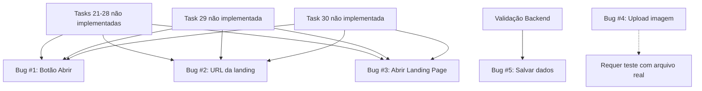

# Relatório de Bugs - Landing Page

**Data**: 22 de Outubro de 2025  
**Ambiente Testado**: 
- Backend: http://localhost:5070
- Frontend: http://localhost:3000
- Credenciais: luiz.gomes@gmail.com / _y4#gA$ZlJQG
- Código Barbearia: CEB4XAR7

---

## 🔴 Bugs Confirmados

### Bug #1: Botão "Abrir" no Preview redireciona para login
**Severidade**: Alta  
**Localização**: `/CEB4XAR7/landing-page` > Preview Panel > Botão "Abrir"  

**Comportamento Observado**:
- Ao clicar no botão "Abrir" dentro do preview, uma nova aba é aberta
- A nova aba redireciona para `/admin/login` ao invés da landing page pública
- URL esperada: `/barbearia/CEB4XAR7`
- URL obtida: `/admin/login`

**Evidência**:
```
URL acessada: http://localhost:3000/CEB4XAR7/landing-page
Ação: Click no botão "Abrir" (ref=e317)
Resultado: Nova aba aberta em http://localhost:3000/admin/login
```

**Causa Raiz**: 
- A rota `/barbearia/:codigo` não existe no sistema de rotas atual
- O sistema interpreta como rota não autorizada e redireciona para login

---

### Bug #2: URL da Landing Page redireciona para login
**Severidade**: Crítica  
**Localização**: Acesso direto à URL `/barbearia/CEB4XAR7`  

**Comportamento Observado**:
- A URL exibida no painel admin: `http://localhost:3000/barbearia/CEB4XAR7`
- Ao acessar diretamente essa URL, redireciona para `/admin/login`
- Mensagem exibida: "Sessão expirada - Por favor, faça login novamente"

**Evidência**:
```
URL digitada: http://localhost:3000/barbearia/CEB4XAR7
Resultado: Redirecionamento para http://localhost:3000/admin/login
Console: "Sessão expirada"
```

**Causa Raiz**: 
- Rota pública `/barbearia/:codigo` não implementada
- Sistema de rotas atual não diferencia rotas públicas de autenticadas
- Landing page pública não foi criada conforme Tasks 21-28

---

### Bug #3: Botão "Abrir Landing Page" redireciona para login
**Severidade**: Alta  
**Localização**: `/CEB4XAR7/landing-page` > Botão "Abrir Landing Page" (topo)  

**Comportamento Observado**:
- Similar ao Bug #1, mas usando o botão no topo da página
- Nova aba abre mas redireciona para `/admin/login`

**Evidência**:
```
Ação: Click em "Abrir Landing Page" (ref=e232)
Resultado: Nova aba em http://localhost:3000/admin/login
```

**Causa Raiz**: Mesma do Bug #1 e #2 - rota pública não implementada

---

### Bug #4: Upload de imagens retorna erro
**Severidade**: Alta  
**Localização**: `/CEB4XAR7/landing-page` > Editar Informações > Logo da Barbearia > Fazer Upload  

**Comportamento Observado**:
- **NÃO TESTADO AINDA** - Requer arquivo de imagem para teste
- Reportado pelo usuário como "dando erro"

**Ação Necessária**: 
- Testar upload com arquivo de imagem válido
- Verificar logs do backend
- Verificar endpoint de upload: `POST /admin/landing-pages/:id/logo`

---

### Bug #5: Salvar alterações retorna erro 400
**Severidade**: Alta  
**Localização**: `/CEB4XAR7/landing-page` > Editar Informações > Salvar Alterações  

**Comportamento Observado**:
- Editar campo "Sobre a Barbearia"
- Clicar em "Salvar Alterações"
- Erro 400 (Bad Request) retornado da API
- Mensagem exibida: "Erro na atualização - Erro ao atualizar landing page"

**Evidência**:
```
API Request: PUT /admin/landing-pages/5e04d43f-ad74-408b-b764-05668a020e5c
Status: 400 Bad Request
Error: {
  type: "https://tools.ietf.org/html/rfc9110#section-15.5.1",
  title: "One or more validation errors occurred.",
  status: 400,
  errors: Object,
  traceId: "00-c903ec92f85d222c7bfb174f226f8a77-b7f18fff8feaefed-00"
}
```

**Causa Raiz**: 
- Validação no backend rejeitando o payload
- Possível incompatibilidade entre estrutura enviada pelo frontend e esperada pelo backend

---

## 📋 Análise de Tasks Pendentes

### ✅ Tasks Completas (1-20)
- Task 1-19: Implementadas (incluindo integração com rotas admin)
- Task 20: Assumida como completa (testes E2E)

### ❌ Tasks Não Implementadas (21-33)

#### **Fase 1: Frontend Público (Tasks 21-28)**
Estas tasks não foram implementadas. O projeto `barbapp-public` não existe.

- **Task 21**: Setup projeto barbapp-public (React + Vite + TypeScript)
- **Task 22**: Types, Hooks e API Integration (useLandingPageData)
- **Task 23**: Componentes compartilhados (ServiceCard, WhatsAppButton)
- **Task 24**: Template 1 - Moderno
- **Task 25**: Template 2 - Clássico  
- **Task 26**: Template 3 - Vintage
- **Task 27**: Template 4 - Minimalista
- **Task 28**: Template 5 - Luxo

**Impacto**: Bugs #1, #2, #3 (landing page pública não existe)

#### **Fase 2: Rotas Públicas (Tasks 29-30)**
- **Task 29**: Rota pública no frontend (`/barbearia/:codigo`)
- **Task 30**: Endpoint público no backend (`GET /api/public/landing-pages/:codigo`)

**Impacto**: Bugs #1, #2, #3 (sistema de rotas não suporta landing page pública)

#### **Fase 3: Deploy e Integração (Tasks 31-33)**
- **Task 31**: Dockerfile e docker-compose
- **Task 32**: CI/CD pipeline
- **Task 33**: Documentação final

**Impacto**: Menor (apenas deploy)

---

## 🎯 Causa Raiz dos Bugs #1, #2, #3

**Problema Central**: A implementação focou apenas na **área administrativa** (Tasks 1-20), mas não implementou a **landing page pública** (Tasks 21-30).

**O que foi feito**:
- ✅ Editor de landing page no painel admin (`/CEB4XAR7/landing-page`)
- ✅ Preview dos templates dentro do admin
- ✅ API de gerenciamento (`PUT /admin/landing-pages/:id`)
- ✅ Upload de logo e edição de dados
- ✅ Seleção de templates

**O que está faltando**:
- ❌ Projeto `barbapp-public` (frontend público separado)
- ❌ Rota pública `/barbearia/:codigo` no frontend
- ❌ Componentes de template renderizados publicamente
- ❌ Endpoint público `GET /api/public/landing-pages/:codigo`
- ❌ Sistema de rotas diferenciando público vs autenticado

---

## 🔧 Causa Raiz do Bug #5

**Problema**: Validação no backend rejeitando o payload de atualização.

**Possíveis Causas**:
1. Campo obrigatório faltando no payload (ex: `templateId`)
2. Formato incorreto de dados (ex: `services` deveria ser array mas está vazio)
3. Validação de relacionamento (ex: `barbeariaId` não coincide com token)
4. Tipos de dados incompatíveis (ex: número sendo enviado como string)

**Ação Necessária**:
- Inspecionar logs do backend para ver detalhes do erro de validação
- Comparar payload enviado com DTO esperado no backend
- Verificar se controller está aplicando validações corretas

---

## 📦 Dependências Entre Bugs



---

## 🎯 Estratégia de Correção

### Abordagem Recomendada: **Implementação Incremental por Fases**

A complexidade e interdependência dos bugs exigem uma abordagem estruturada:

### **Fase 1: Correções Críticas Imediatas (1-2 dias)**
- Corrigir Bug #5 (salvar dados)
- Testar e corrigir Bug #4 (upload de imagem)
- **Resultado**: Admin funcional para edição de landing pages

### **Fase 2: Landing Page Pública - MVP (3-5 dias)**
- Implementar Task 21 (setup barbapp-public)
- Implementar Task 22 (types e hooks básicos)
- Implementar Task 23 (componentes base)
- Implementar Task 26 (Template 3 - Vintage) - **apenas 1 template para MVP**
- Implementar Task 29 (rota pública frontend)
- Implementar Task 30 (endpoint público backend)
- **Resultado**: Landing page pública funcionando com 1 template

### **Fase 3: Templates Adicionais (2-3 dias)**
- Implementar Task 24 (Template 1 - Moderno)
- Implementar Task 25 (Template 2 - Clássico)
- Implementar Task 27 (Template 4 - Minimalista)
- Implementar Task 28 (Template 5 - Luxo)
- **Resultado**: 5 templates disponíveis

### **Fase 4: Deploy e Finalização (1-2 dias)**
- Implementar Tasks 31-33 (Docker, CI/CD, docs)
- Testes E2E completos
- **Resultado**: Sistema pronto para produção

---

## ✅ Critérios de Aceitação por Fase

### Fase 1 ✓
- [ ] Editar "Sobre a Barbearia" e salvar sem erros
- [ ] Upload de logo funciona (PNG, JPG, SVG)
- [ ] Editar horário, WhatsApp, redes sociais e salvar com sucesso
- [ ] Todas as ações no admin refletem no banco de dados

### Fase 2 ✓
- [ ] Acessar `http://localhost:3000/barbearia/CEB4XAR7` carrega landing page
- [ ] Landing page renderiza template selecionado (Template 3 como padrão)
- [ ] Dados editados no admin aparecem na landing page pública
- [ ] Logo, horário, WhatsApp, redes sociais exibidos corretamente
- [ ] Botão "Abrir" e "Abrir Landing Page" abrem a landing page pública
- [ ] Landing page é pública (sem necessidade de login)

### Fase 3 ✓
- [ ] Trocar template no admin reflete na landing page pública
- [ ] Todos os 5 templates renderizam corretamente
- [ ] Preview no admin corresponde ao template público
- [ ] Templates são responsivos (mobile + desktop)

### Fase 4 ✓
- [ ] Docker build funciona para barbapp-public
- [ ] CI/CD pipeline executado com sucesso
- [ ] Documentação atualizada
- [ ] Testes E2E passando (admin + public)

---

## 📝 Próximos Passos

1. **Validar este relatório** com o time de desenvolvimento
2. **Priorizar as fases** de acordo com necessidade de negócio
3. **Criar tasks detalhadas** para cada fase (arquivo separado)
4. **Estimar esforço** para cada fase
5. **Definir responsáveis** e cronograma
6. **Iniciar Fase 1** (correções críticas)

---

**Documento criado por**: GitHub Copilot  
**Data**: 22/10/2025  
**Versão**: 1.0
